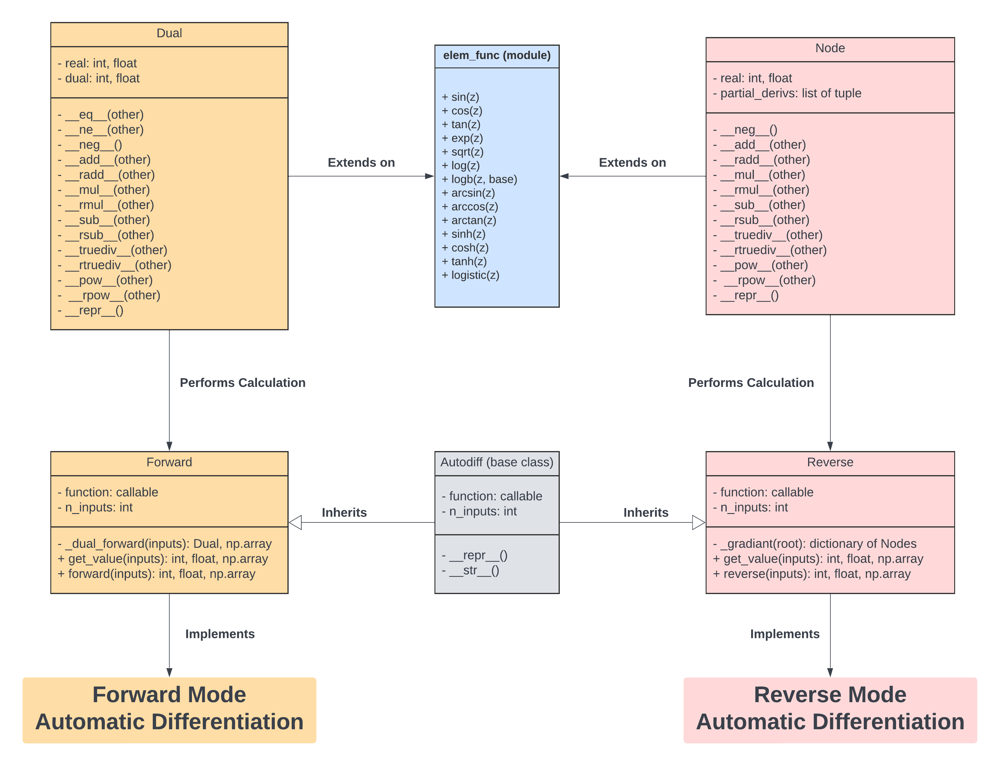

# team11

Final project: a `python` **automatic differentiation (AD)** library.

See our code coverage report (99%) [here](https://code.harvard.edu/pages/CS107/team11/).

## Team Member

| **Name**       |      **Email Address**       |
| :------------: | :--------------------------: |
| Haoxue Fan     |   haoxue_fan@g.harvard.edu   |
| Sarah Rathnam  | sarah_rathnam@g.harvard.edu  |
| Mahnum Shahzad | mahnum_shahzad@g.harvard.edu |
| Shirley Wang   |  shirleywang@g.harvard.edu   |
| Alaric Wei     |  xiangyu_wei@g.harvard.edu   |

## Package Design

# Documentation

[Here](https://cs107-team11.readthedocs.io/en/latest/) is the documentation of `pomeranian` package.

# Broader Impact and Inclusivity Statement

## Broader Impacts
A package such as `pomeranian` has substantial broader impacts with many potential societal benefits. However, this comes with great responsibility. The downstream applications have potential to be used in software that perpetuate social harms. For instance, existing recidivism algorithms are biased against Black defendants and social media algorithms amplify targeted misinformation; future applications of automatic differentiation software could be used to reinforce discriminatory practices. 

The question of how `pomeranian` should be used ethnically has no simple solution. As a start, the developers and users of software should include individuals from diverse backgrounds, and assess algorithmic bias at each stage (e.g., from data collection to model development in applications). Beyond technical solutions, engineers, data scientists, and all who interact with these systems should recognize this work occurs in the context of systems built on foundations of discrimination, and work towards building a more equitable, diverse, and inclusive community.

## Inclusivity 
In *principle*, software development should have no barriers based on sociodemographic characteristics. In *practice*, biases are baked into every step of this process. From institutional and interpersonal racism that contributes to persistent underrepresentation of people of color (particularly women of color), to biases that perpetuate stereotypes about “who looks like” an engineer/scientist, our field has immense systemic inequities. Simple statements such as “we welcome everyone, regardless of background” are insufficient to address the complex causes of persistent inequities in whose voices and contributions are valued in software development.

We, the developers of `pomeranian`, are committed to working against systems of inequality through our research and teaching. Regarding development practices, we will advertise our software and invite contributions on a range of listservs/platforms to ensure dissemination to a broad audience. We will review and approve pull requests as a group with diverse backgrounds to carefully consider implications of new developments, and regularly seek feedback on the cultural climate of our group. In addition, we will engage in community-based outreach to foster excitement in computer science, particularly in historically underrepresented communities in STEM. We do not tolerate bias-motivated behaviors based on social group membership (e.g., race, ethnicity, gender, sexual orientation, disability, citizenship). Finally, we recognize these disparities cannot be solved by diversity initiatives at the software development stage alone, but require thoughtful and intentional restructuring of pedagogical practices at all levels (from elementary to graduate education), accompanied by activism and advocacy efforts within the broader community. 
