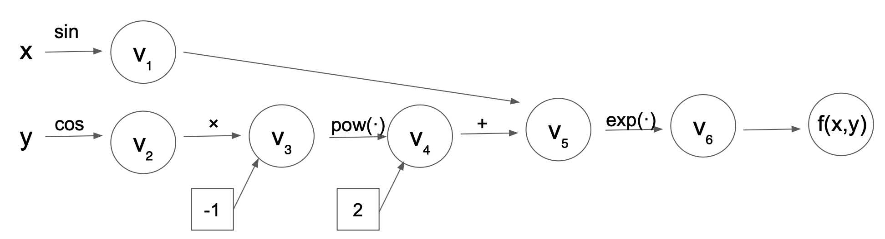

# Milestone 2

## Introduction

Derivatives play a central role across the sciences, engingeering, technology, and mathematics (STEM) fields. For instance, the calculation of derivatives is necessary for training deep neural networks (i.e., in back propagation), optimizing functions, building economic models, modeling disease spread (e.g., of COVID-19), and examining change in complex systems over time (e.g., physical systems, biological systems). Unfortunately, it is often impossible or infeasible to compute derivatives analytically in real-life problems due to their complexity.

One potential solution to this problem is the finite-difference method, which is a numerical method for approximating the solution to differential equations. The finite-difference method relies on the definition of a derivative to approximate its solution:

$$
\frac{df}{dx} = \lim\limits_{\epsilon \to 0} \frac{f(x+\epsilon)-f(x)}{\epsilon}
$$

Of note, the finite-difference method relies on choosing the best $\epsilon$ value, and it is unclear how to do so. Poorly-chosen $\epsilon$ values may cause inaccurate approximations or instability of solutions (e.g., due to floating point errors). Therefore, another potential method of finding derivatives in real-world applications is symbolic differentiation, which works directly with mathematical equations. However, there are important limitations to this method as well. Specifically, symbolic differentiation can be too computationally costly when functions become highly complex, is a very memory-intensive process, and may not always be applicable depending on the exact form of the function.

These limitations motivate the use of **automatic differentiation (AD)**. AD is a method that is capable of evaluating the derivative of a function specified by a computer program at machine precision, which does not rely entirely on symoblic math (like symbolic differentiation) nor on evaluating the original function at sample points (like the finite-difference method). Rather, AD uses the chain rule to break complex functions into smaller pieces and evaluates only elementary operations at each step. Thus, AD is more easily applicable to a wide range of complex functions suitable for use in real-life applications.

Our package `Pomeranian` is a [PyPI](https://pypi.org/)-distributed Python library to perform AD. Just as pomeranians are known for their intelligence, friendliness, and confidence in tackling challenging problems (e.g., taking on big dogs despite their small size), our package is also user-friendly, powerful, and able to compute solutions to complex problems using simple/elementary operations.

Below, we describe the mathematical background and concepts underlying AD, as well as the usage, software organization, implementation, and licensing of our `Pomeranian` package.

## Background

### Chain rule

[Chain rule](https://en.wikipedia.org/wiki/Chain_rule) is at the heart of automatic differentiation. It enables us to decompose complex functions into piecewise evaluation. Suppose that we have a function $g(h(x))$. We could apply chain rule to calculate the derivative of g with respect to t:

$$
    \frac{dg}{dx} = \frac{\partial g}{\partial h}\frac{\partial h}{\partial x}
$$

Chain rule can also be used in a high dimensional scenario. If we have a function $g(h(x))$ where $h\in R^n$ and $x\in R^m$. The derivative can be expressed as a gradient vector:

$$
    \nabla_xg=\sum^n_{i=1}\frac{\partial g}{\partial h_i}\nabla h_i(x)
$$

### Elementary functions

A complex function could be broken down into elementary functions in order to evaluate them piecewise. [Elementary functions](https://en.wikipedia.org/wiki/Elementary_function) is a function of a single variable that is defined as taking sums, products, roots, and other functions.

### Forward mode

In forward mode, we evaluate the intermediate results $v_i$ and the directional derivative at the same time.

#### Evaluation trace

The evaluation of a function involves partial ordering of the operations associated with f, forming a evaluation trace. The evaluation trace introduces intermediate results $v_i$ that elementary functions could operate on. These intermediate results depend on independent variables.

#### Computational graph

We could visualize the evaluation trace as a computational graph, with each intermediate variable as a node and each elementary function as a edge. For example, the computational graph for $f(x, y)=e^{sin(x)-cos(y)^2}$ looks like the graph below:



### Directional derivative and seed vector

In the computational graph for the forward mode, each node not only carries the evaluation of intermediate variable, but also a directional derivative of the intermediate variable in a given direction $p \in R^m$. These two operations happen simultaneously and are termed as the primal trace and the tangent trace. The directional derivative is calculated by projecting the gradient vector into the direction of the seed vector $p$:

$$
    D_pg_i \stackrel{\text{def}}{=}   \nabla_xg=\sum^n_{i=1}\frac{\partial g}{\partial h_i}\nabla h_i(x)
$$

In other words, the forward mode AD computes the inner product of the Jacobian with the seed vector p ($J \in R^{n \cdot m}, p \in R^m$)

$$
    J \cdot p
$$

which can be interpreted as projecting Jacobian in the direction given by p. The full Jacobian can be calculated in forward mode AD using m passes, where seed vectors p are set to the m-th unit vector along coordinate $x_m$ for the m-th pass.

The evaluation trace of function $f(x, y)=e^{sin(x)-cos(y)^2}$ at $(x,y)=(\pi/2, \pi/3)$ is as the table follows:

| Trace | Elementary Function | Value       | Elementary Function Derivative | $\nabla x$ value | $\nabla y$ value       |
|------------|------------|------------|------------|------------|------------|
| $x$   | $\pi/2$             | $\pi/2$     | 1                              | 1                | 0                      |
| $y$   | $\pi/3$             | $\pi/3$     | 1                              | 0                | 1                      |
| $v_1$ | $sin(x)$            | 0           | $cos(x)D_pv_1$                 | 0                | 0                      |
| $v_2$ | $cos(y)$            | 0.5         | $-sin(y)D_pv_2$                | 0                | $-\sqrt{3}/2$          |
| $v_3$ | $v_2^2$             | 0.25        | $2v_2D_pv_3$                   | 0                | $-\sqrt{3}$            |
| $v_4$ | $-v_3$              | -0.25       | $-D_pv_4$                      | 0                | $\sqrt{3}$             |
| $v_5$ | $v_1+v_4$           | -0.25       | $D_pv_1+D_pv_4$                | 0                | $\sqrt{3}$             |
| $v_6$ | $e^{v_5}$           | $e^{-0.25}$ | $e^{v_5}D_pv_5$                | 0                | $\sqrt{3}e^{\sqrt{3}}$ |

As observed from the table, in the forward mode AD, we are only working with elementary functions whose derivatives are known. therefore, it is trivial to calculate $D_pv_j$

### Reverse mode

The table below shows some major differences between the forward and the reverse mode:

| forward mode                                                                                       | reverse mode                                                                                                    |
|----------------------------------|--------------------------------------|
| \- evaluate the intermediate variable $v_j$ and its directional derivative $D_pv_j$ simultaneously | \- does NOT evaluate $v_j$ and $D_pv_j$ simultaneously                                                          |
| \- m passes                                                                                        | \- 2 passes                                                                                                     |
| \- compute the gradient $f$ with respect to the independent variables                              | \- compute the sensitivity $v_{j-m}$ of $f$ with respect to the independent AND intermediate variable $v_{j-m}$ |
| \- evaluate the function from inside out                                                           | \- traversing the computational graph backwards                                                                 |
| \- could use dual number                                                                           | \- can NOT use dual number                                                                                      |
| \- have a larger algorithmic operation count (usually in a factor of 5)                            | \- have to store the whole computational graph                                                                  |

### Dual number

A dual number, similar to a complex number, has a real part and a dual part: $z = a + b \epsilon$, where $\epsilon$ is a high order term and we define $\epsilon^2=0$. Dual numbers are useful to encode the primal and the tangential traces. It is a useful data structure in carrying out the forward mode of autodifferentiation, since the function evaluation and directional derivative are calculated simultaneously in the forward mode.For example, let f and g be two functions th $f\prime$ and $g\prime$ being their derivatives.We construct two dual numbers:

$$
z_1 = f + f\prime\epsilon
$$

$$
z_2=g+g\prime\epsilon
$$

Therefore, we have:

$$
z_1 + z_2 = (f + g) + (f\prime + g\prime)\epsilon
$$

$$
z_1 \cdot z_2 = (f \cdot g) + (f\cdot g\prime + g\cdot f\prime)\epsilon
$$

It can be observed that adding dual numbers together resembles the addition both for the evaluation and the directional derivative parts. Similarly, the multiplication of dual numbers resembles the multiplication of the functions in the real part and the product rule of the directional derivative in the dual part. Therefore, it is a useful structure to encode the primal and the tangential traces.

## How to use `Pomeranian` for Forward Mode Automatic Differentiation

After the `Pomeranian` package is distributed via [PyPI](https://pypi.org/) or [TestPyPI](https://test.pypi.org/). the user can install `Pomeranian` using an installer program with the following code (all dependencies (`numpy`) will also be installed):

    pip install Pomeranian

However, since package is still in development, the user will need to do the following to install our package:

1.  Clone our package from Github Enterprise

        git clone git@code.harvard.edu:CS107/team11.git

2.  Create and activate a virtual environment

        python -m venv venv
        source venv/bin/activate

3.  Install all the dependencies of package under `team11/requirements.txt`

        pip install -r team11/requirements.txt

4.  Export module directory to `PYTHONPATH`

        export PYTHONPATH="${PYTHONPATH}:/DOWNLOAD_PATH/team11/pomeranian"

After installing, the main forward mode and elementary functions functionality can be imported using the following:

``` python
import forward as ad      # main forward mode module
import elem_func as func  # elementary function module
```

The package is flexible and can handle univariate/multivariable inputs as well as single/multiple functions at the same time. Below we provide examples of multiple different cases to allow the user to pick the format that best suits their use case.

1.  Single variable with single function to evaluate:

    ``` python
    f = lambda x: x * 2 + 5
    ```

2.  Single variable with multiple functions to evaluate:

    ``` python
    f = lambda x: [x * 2 + 5, func.sin(fun.sqrt(x))]
    ```

3.  Multivariable with single function to evaluate:

    ``` python
    f = lambda x, y: func.exp(x ** 2 + y ** 2)
    ```

4.  Multivariable with multiple functions to evaluate:

    ``` python
    f = lambda x, y: [x ** 2, func.exp(x + y)]
    ```

After the function(s) has been defined using any of the formats above, set a new variable as an instance of the `Forward` class. The package can be used to evaluate the value of a function at a given input using the `get_value()` function. The value of the derivative can be accessed using the `forward()` function. the user can follow the example (requirement for milestone2: univariate input & function) below to test our `Pomeranian` package.

``` python
import forward as ad
import elem_func as func

# univariate input, univariate function
f = lambda x: x * 2 + 5
example = ad.Forward(f)
print(example.get_value(4))
>>> 13
print(example.forward(4))
>>> 2

# other elementary functions
f = lambda x: func.log(x)
example = ad.Forward(f)
print(example.get_value(4))
>>> 1.3862943611198906
print(example.forward(4))
>>> 0.25
```

See [Implementation](#implementation) for more information about methods, and how [Multivariate Inputs and Multiple Functions](#multivariate-inputs-and-multiple-functions) are handled.

## Software Organization {#software-organization}

**Directory structure**: The following is how we plan to organize the software.

    team11
    ├── .gitignore
    ├── LICENSE
    ├── README.md
    ├── setup.cfg
    ├── setup.py  
    ├── requirements.txt   
    │  
    ├── .github/workflows
    │   ├── coverage.yml
    │   └── test.yml 
    │
    ├── docs
    │   ├── pictures (milestone1, milestone2 pictures)
    │   ├── sphinx (final documentations)
    │   ├── README.md
    │   ├── milestone1.md
    │   ├── milestone1.pdf
    │   ├── milestone2.md
    │   ├── milestone2_progress.md
    │   └── ...
    │
    ├── pomeranian
    │   ├── __init__.py
    │   ├── autodiff.py (AutoDiff base class)
    │   ├── dual.py (Dual class)
    │   ├── elem_func.py (ElementaryFunction module)
    │   ├── forward.py (Forward class)
    │   ├── node.py (Node class, TBW)
    │   ├── reverse.py (Reverse class, TBW)
    │   └── ...
    │
    ├── testsrun_tests.sh
    │   ├── run_tests.sh (script to run test)
    │   ├── test_AutoDiff.py (tests for AutoDiff)
    │   ├── test_Dual.py (tests for Dual)
    │   ├── test_Elem.py (tests for ElementaryFunction)
    │   ├── test_FM.py (tests for Forward)
    │   ├── test_Node.py (tests for Node)
    │   ├── test_RM.py (tests for Reverse)
    │   └── ...
    │

**Modules**: There are four directories in the package

1)  pomeranian: the main package containing all the modules/classes (including `Dual`, `Node`, `Forward`, `Reverse`, `ElementaryFunction`, etc.) for AD; other dependencies (`numpy`) is also imported to facilitate structure and calculation
2)  tests: unit tests for pomeranian AD algorithms and functions
3)  docs: additional documents and milestones for project development
4)  .github/workflow (hidden): workflow configuration files

**Test suite design** Test suite is included in the tests directory at the top level, which is the same level as the main package. Python built-in `pytest` are used to write test functions for each class separately. Github Actions is used as a CI process (in Github Enterprise) to automatically test code integration and document generation.

**Distribution & Considerations** As mentioned above, package is distributed via [PyPI](https://pypi.org/) or [TestPyPI](https://test.pypi.org/). Structure of the package is designed to be modular to optimize teamwork and collaboration, and minimize chances of merge conflicts.

## Implementation {#implementation}

### Core Data Structures

-   Input:
    -   Function
        -   We treat all functions as vector-valued. A scalar function is a vector of length 1.
        -   Each scalar function in the vector-valued function is represented by a string.
    -   Differentiation point
        -   Dictionary containing the variable name and value for each dimension of the point at which we perform AD
    -   Seed vector: vector $p$ for directional derivative
-   Dual number: Class, for use in forward mode AD
-   Node: Class, for use in reverse mode AD
-   Intermediate values, returned values, and partial derivatives to be stored in an np.arrays

### Classes {#classes}

-   `Dual`: dual number, represent a number and the derivative of the function at the number, for use in forward mode AD
-   `Node`: value, children, and associated local gradients, for use in reverse mode AD
-   `AutoDiff`: base class for AD
-   `Forward`: implements forward mode AD
-   `Reverse`: implements reverse mode AD
-   `ElementaryFunction` (module): includes other overloaded elementary functions (e.g., trig, log, exponential, etc.) that cannot be defined in `Dual` and `Node` class

### Method and Name Attributes {#method-and-name-attributes}

-   `Dual` class: for use in Forward
    -   Attributes:
        -   self.real: real part of dual number, to calculate value $v_i$ of function
        -   self.dual: dual part of dual number, to calculate value $D_p V_i$
    -   Methods
        -   dunder methods overload (e.g. \_\_*add*\_\_, \_\_*mul*\_\_, \_\_*sub*\_\_, etc.; see [Implementation Example](#implementation-example) below for dunder method overloading)
-   `Node` class: for use in Reverse
    -   Attributes:
        -   self.value: real value of function
        -   self.children: child nodes of children in the computational graph
        -   self.partial_derivs: partial derivative for a given Node instance with respect to each of its child nodes
    -   Methods:
        -   dunder methods overload (e.g. \_\_*add*\_\_, \_\_*mul*\_\_, \_\_*sub*\_\_, etc.; see [Implementation Example](#implementation-example) below for dunder method overloading)
-   `AutoDiff` base class:
    -   Attributes:
        -   self.function: vector-valued input function
    -   Methods:
        -   dunder methods overload (e.g., \_\_*repr*\_\_, \_\_*str*\_\_, etc.)
-   `Forward` class (inherit AutoDiff):
    -   Attributes:
        -   self.function: inherited from AutoDiff class
    -   Methods
        -   get_value: return the value of function applied at input variables
        -   forward: calculate derivative/jacobian of formula(s) by forward mode AD
        -   dunder methods overload (e.g., \_\_*repr*\_\_, etc.)
-   `Reverse` class (inherit AutoDiff):
    -   Attributes:
        -   self.function: inherited from AutoDiff class
    -   Methods:
        -   get_value: return the value of function applied at input variables
        -   reverse: calculate derivative/jacobian of formula(s) by reverse mode AD
        -   dunder methods overload (e.g., \_\_*repr\_\_*, etc.)
-   `ElementaryFunction` module: includes other overloaded elementary functions (e.g., `sin()`, `cos()`, `tan()`, `exp()`, `sqrt()`, `log()`, `logb()`, `arcsin()`, `arccos()`, `arctan()`, `sinh()`, `cosh()`, `tanh()`, `logistic()`, etc.) that cannot be defined in `Dual` and `Node` class. See [Implementation Example](#implementation-example) below for elementary function overloading.

### Implementation Example {#implementation-example}

We have implemented operator overloading as in the following example (dunder `add` method):

``` python
def __add__(self, other):
    if isinstance(other,(int,float)):
        real_part = self.real + other
        dual_part = self.dual
    elif isinstance(other,Dual):
        real_part = self.real + other.real
        dual_part = self.dual + other.dual
    else:
        raise TypeError('Input must be type float, int, or Dual')

    return Dual(real_part,dual_part)
```

We have implemented elementary function overloading as in the following example (`sin()`):

``` python
def sin(z):
    if isinstance(z, Dual):
        real_part = np.sin(z.real)
        dual_part = z.dual*np.cos(z.real)
        return Dual(real_part,dual_part)
    else:
        return np.sin(z)
```

### Multivariate Inputs and Multiple Functions {#multivariate-inputs-and-multiple-functions}

All multivariate inputs and functions are handled internally within `Forward` and `Reverse` class. As mentioned in the example, the user can input four different cases of function inputs, all of which share similar format.

Regarding multivariate inputs (e.g., $\vec{x} = [x_1, x_2]$), the user needs to specify multiple input parameters for a single function.

Regarding multiple functions (e.g., $\vec{f} = [f_1, f_2]$), the user need to return a single list with callable functions as the returned variable.

For example, to call the function

$$
f(x_1, x_2) = 
\begin{bmatrix} 
x_1^2 \\ 
e^{x_1 + x_2} 
\end{bmatrix}
$$

the user inputs the following codes:

``` python
f = lambda x1, x2: [x1 ** 2, func.exp(x1 + x2)]
```

When calling `get_value()` and `forward()` methods, the package will automatically convert all inputs to `Dual` numbers internally and calculate the value and derivatives.

### External Dependencies

-   `numpy` (data structure, elementary functions)

### Elementary Functions

-   Elementary functions are defined in the `ElementaryFunction` class for both `Dual` and `Node` classes. We use existing modules `numpy` define functions for dual/node using operator overloading.
-   Derivatives: Derivatives are handled by the operator overloading. For forward mode, derivatives are calculated using the self.dual part of the dual number. For reverse mode, self.partial_derivs stores the partial derivative for a given Node instance with respect to each of its child nodes.

## Future Features

We will implement **Reverse Mode** as the new extended feature.

As specified in [Classes](#classes) and [Method and Name Attributes](#method-and-name-attributes), reverse mode will be implemented in `Reverse` class, which inherits `AutoDiff` base AD class. The `Node` class will be used (similarly as `Dual` in forward mode) to store the real value update the partial derivatives of child nodes. Operator overloading will be done in `Node` class, and elementary function overloading will be done in `ElementaryFunction` module. [Multivariate inputs and Multiple Functions](#multivariate-inputs-and-multiple-functions) will be dealt with the same as `Forward` mode. When calling `get_value()` and `reverse()` methods, the package will automatically convert all inputs to `Node` numbers internally and calculate the value and derivatives.

`Reverse` class will be organized within the same directory of other main classes and modules. `Reverse` and `Node` will both be tested repsectively using `pytest` in the test suite (see [Software Organization](#software-organization)).

## Licensing

We license our program under an MIT License which is both simple and permissive. It allows any users to use, modify, or distribute the software without any associated liability for our team.
