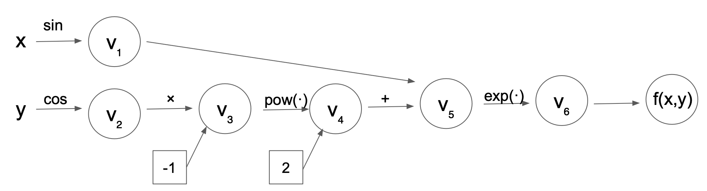

.. Pomeranian documentation master file, created by
   sphinx-quickstart on Tue Nov 15 11:06:50 2022.
   You can adapt this file completely to your liking, but it should at least
   contain the root `toctree` directive.

Welcome to Pomeranian's documentation!
=======================================

Introduction
=============

The Pomeranian package allows users to calculate derivatives of complicated differential equations to machine precision! The user can choose either of forward mode differentiation or reverse mode differentiation for their calculations. 

The calculation of derivatives is integral to many problems across disciplines. For instance, the calculation of derivatives is necessary for training deep neural networks (i.e., in back propogation), optimizing functions, building economic models, modeling disease spread (e.g., of COVID-19), and examining change in complex systems over time (e.g., physical systems, biological systems). Pomeranian provides a method to solve complicated differential equations being especially useful for cases where symbolic differentiation or numerical approximations are infeasible or inaccurate respectively.
 

Motivation for Automatic Differentiation
=========================================

Automatic differentiation is often contrasted with other methods for calculating derivations such as the finite-difference method, which is a numerical method for approximating the solution to differential equations. The finite-difference method relies on the definition of a derivative to approximate its solution: 

.. math::

    \frac{df}{dx} = \lim\limits_{\epsilon \to 0} \frac{f(x+\epsilon)-f(x)}{\epsilon}

Of note, the finite-difference method relies on choosing the best :math:`\epsilon` value, and it is unclear how to do so. Poorly-chosen :math:`\epsilon` values may cause inaccurate approximations or instability of solutions (e.g., due to floating point errors). 

Another potential method of finding derivatives in real-world applications is symbolic differentiation, which works directly with mathematical equations. However, there are important limitations to this method as well. Specifically, symbolic differentiation can be too computationally costly when functions become highly complex, is a very memory-intensive process, and may not always be applicable depending on the exact form of the function. 

These limitations motivate the use of **automatic differentiation (AD)**. AD is a method that is capable of evaluating the derivative of a function specified by a computer program at machine precision, which does not rely entirely on symoblic math (like symbolic differentiation) nor on evaluating the original function at sample points (like the finite-difference method). Rather, AD uses the chain rule to break complex functions into smaller pieces and evaluates only elementary operations at each step. Thus, AD is more easily applicable to a wide range of complex functions suitable for use in real-life applications.

Our package ``Pomeranian`` is a `PyPI <https://pypi.org/>`_-distributed Python library to perform AD. Just as pomeranians are known for their intelligence, friendliness, and confidence in tackling challenging problems (e.g., taking on big dogs despite their small size), our package is user-friendly, powerful, and able to compute solutions to complex problems using simple/elementary operations. 

Below, we describe the mathematical background and concepts underlying AD, as well as the usage, software organization, implementation, and licensing of our ``Pomeranian`` package.

Background 
===========

Chain rule
-----------
`Chain rule <https://en.wikipedia.org/wiki/Chain_rule>`_ is at the heart of automatic differentiation. It enables us to decompose complex functions into piecewise evaluation. 
Suppose that we have a function :math:`g(h(x))`. We could apply chain rule to calculate the derivative of g with respect to t:

.. math::

    \frac{dg}{dx} = \frac{\partial g}{\partial h}\frac{\partial h}{\partial x}

Chain rule can also be used in a high dimensional scenario. If we have a function :math:`g(h(x))` where :math:`h \in R^n` and :math:`x \in R^m`. The derivative can be expressed as a gradient vector:

.. math::

    \nabla_xg=\sum_{{i=1}^{n}}\frac{\partial g}{\partial h_i}\nabla h_i(x)

Elementary functions
---------------------
A complex function could be broken down into elementary functions in order to evaluate them piecewise. `Elementary functions <https://en.wikipedia.org/wiki/Elementary_function>`_ is a function of a single variable that is defined as taking sums, products, roots, and other functions. 

Forward mode
-------------
In forward mode, we evaluate the intermediate results :math:`v_i` and the directional derivative at the same time.

Evaluation trace
-----------------
The evaluation of a function involves partial ordering of the operations associated with f, forming a evaluation trace. The evaluation trace introduces intermediate results :math:`v_i` that elementary functions could operate on. These intermediate results depend on independent variables.

Computational graph
--------------------
We could visualize the evaluation trace as a computational graph, with each intermediate variable as a node and each elementary function as a edge. For example, the computational graph for :math:`f(x, y)=e^{sin(x)-cos(y)^2}` looks like the graph below:

Directional derivative and seed vector
---------------------------------------
In the computational graph for the forward mode, each node not only carries the evaluation of intermediate variable, but also a directional derivative of the intermediate variable in a given direction :math:`p \in R^m`. These two operations happen simultaneously and are termed as the primal trace and the tangent trace. The directional derivative is calculated by projecting the gradient vector into the direction of the seed vector :math:`p`:

.. math::

    D_pg_i \stackrel{\text{def}}{=}   \nabla_xg=\sum_{{i=1}^{n}}\frac{\partial g}{\partial h_i}\nabla h_i(x)

In other words, the forward mode AD computes the inner product of the Jacobian with the seed vector p (:math:`J \in R^{n \cdot m}, p \in R^m`)

.. math::
    J \cdot p

which can be interpreted as projecting Jacobian in the direction given by p. The full Jacobian can be calculated in forward mode AD using :math:`m` passes, where seed vectors p are set to the m-th unit vector along coordinate :math:`x_m` for the m-th pass.

The evaluation trace of function :math:`f(x, y)=e^{sin(x)-cos(y)^2}` at :math:`(x,y)=(\pi/2, \pi/3)` is as the table follows:

.. list-table:: 
    :widths: 10 10 10 10 10 10 
    :header-rows: 1
    
    * - Trace
      - Elementary Function
      - Value
      - Elementary Function Derivative
      - :math:`\nabla x` value 
      - :math:`\nabla y` value 

    * - :math:`x` 
      - :math:`\pi/2` 
      - :math:`\pi/2`
      - 1
      - 1
      - 0

    * - :math:`y` 
      - :math:`\pi/3` 
      - :math:`\pi/3`
      - 1
      - 0
      - 1

    * - :math:`v_1`
      - :math:`sin(x)` 
      - 0 
      - :math:`cos(x)D_pv_1`
      - 0 
      - 0  

    * - :math:`v_2`
      - :math:`cos(y)` 
      - 0.5
      - :math:`-sin(y)D_pv_2`
      - 0
      - :math:`-\sqrt{3}/2`   

    * - :math:`v_3`
      - :math:`v_2^2`
      - 0.25
      - :math:`2v_2D_pv_3`
      - 0
      - :math:`-\sqrt{3}` 

    * - :math:`v_4`
      - :math:`-v_3` 
      - -0.25
      - :math:`-D_pv_4`
      - 0
      - :math:`\sqrt{3}`

    * - :math:`v_5`
      - :math:`v_1+v_4`
      - -0.25
      - :math:`D_pv_1+D_pv_4`
      - 0
      - :math:`\sqrt{3}` 

    * - :math:`v_6`
      - :math:`e^{v_5}`
      - :math:`e^{-0.25}`
      - :math:`e^{v_5}D_pv_5`
      - 0
      - :math:`\sqrt{3}e^{\sqrt{3}}` 

As observed from the table, in the forward mode AD, we are only working with elementary functions whose derivatives are known. therefore, it is trivial to calculate :math:`D_pv_j`

Reverse mode
-------------
The table below shows some major differences between the forward and the reverse mode:

+-------------------------------------------------------------------------------------------------------------------+---------------------------------------------------------------------------------------------------------------------------------------+
| forward mode                                                                                                      | reverse mode                                                                                                                          |
+===================================================================================================================+=======================================================================================================================================+
| - evaluate the intermediate variable :math:`v_j` and its directional derivative :math:`D_pv_j` simultaneously     | - does NOT evaluate :math:`v_j` and :math:`D_pv_j` simultaneously (partial at forward pass but chained derivatives at reverse pass)   |
| - m passes                                                                                                        | - 2 passes                                                                                                                            |
| - compute the gradient :math:`f` with respect to the independent variables                                        | - compute the sensitivity :math:`v_{j-m}` of :math:`f` with respect to the independent AND intermediate variable :math:`v_{j-m}`      |
| - evaluate the function from inside out                                                                           | - traversing the computational graph backwards                                                                                        |
| - could use dual number                                                                                           | - can NOT use dual number                                                                                                             |
| - have a larger computational count (usually in a factor of 5)                                                    | - have to store the whole computational graph                                                                                         |
+-------------------------------------------------------------------------------------------------------------------+---------------------------------------------------------------------------------------------------------------------------------------+

Dual number
------------
A dual number, similar to a complex number, has a real part and a dual part: :math:`z = a + b \epsilon`, where :math:`\epsilon` is a high order term and we define :math:`\epsilon^2=0`. Dual numbers are useful to encode the primal and the tangental traces. It is a useful data structure in carrying out the forward mode of autodifferentiation, since the function evaluation and directional derivative are calcualted simultaneously in the forward mode. For example, let :math:`f` and :math:`g` be two functions th :math:`f\prime` and :math:`g\prime` being their derivatives. We construct two dual numbers: 

.. math::

    z_1 = f + f\prime\epsilon

.. math::

    z_2= g + g\prime\epsilon

Therefore, we have:

.. math::

    z_1 + z_2 = (f + g) + (f\prime + g\prime)\epsilon

.. math::

    z_1 \cdot z_2 = (f \cdot g) + (f\cdot g\prime + g\cdot f\prime)\epsilon

It can be observed that adding dual numbers together resembles the addition both for the evluation and the directional direvative parts. Similarly, the multiplication of dual numbers resemble the multiplication of the functions in the real part and the product rule of the directional derivative in the dual part. Therefore, it is a useful structure to encode the primal and the tangential traces.

Pomeranian Installation
========================

The ``Pomeranian`` package is distributed via `PyPI <https://pypi.org/>`_ (see `here <https://test.pypi.org/project/pomeranian/>`_ for the package).
To install ``Pomeranian``, use an installer program with the following code

.. code-block:: console

   pip install -i https://test.pypi.org/simple/ pomeranian

All the extra dependencies (``numpy``) wil also be installed.

How to use ``Pomeranian``
==========================

After installation, the main forward mode, reverse mode, and elementary functions functionality can be imported using the following:

.. code-block:: python

    from pomeranian.forward import Forward  # main forward mode module
    from pomeranian.reverse import Reverse  # main reverse mode module
    import pomeranian.elem_func as func     # elementary function module

Define Function
----------------
The package is flexible and can handle univariate/multivariable inputs as well as single/multiple functions at the same time. Below we provide examples of multiple different cases to allow the user to pick the format that best suits their use case.

1.  Single variable with single function to evaluate:

.. code-block:: python

    f11 = lambda x: x * 2 + 5

2.  Single variable with multiple functions to evaluate:

.. code-block:: python

    f12 = lambda x: [x * 2 + 5, func.sin(func.sqrt(x))]

3.  Multivariable with single function to evaluate:

.. code-block:: python

    f21 = lambda x, y: func.exp(x ** 2 - y ** 2)

4.  Multivariable with multiple functions to evaluate:

.. code-block:: python

    f22 = lambda x, y: [x ** 2, func.log(x + y)]

Forward Mode
-------------
After the function(s) has been defined using any of the formats above, set a new variable as an instance of the ``Forward`` class. The package can be used to evaluate the value of a function at a given input using the ``get_value()`` function. The derivative/Jacobian can be accessed using the ``forward()`` function. Follow the example below to use our ``Pomeranian`` package.

.. code-block:: python

    from pomeranian.forward import Forward
    import pomeranian.elem_func as func 

    # univariate input, single function
    ad11 = Forward(f11)
    print(ad11.get_value(3.55))
    >>> 12.1
    print(ad11.forward(3.55))
    >>> 2

    # univariate input, multiple functions
    ad12 = Forward(f12)
    print(ad12.get_value(3.55))
    >>> [12.1         0.95130689]
    print(ad12.forward(3.55))
    >>> [ 2.         -0.08179983]

    # multivariate inputs, single function
    ad21 = Forward(f21)
    print(ad21.get_value([3.55, -2.38]))
    >>> 1030.8098145221436
    print(ad21.forward([3.55, -2.38]))
    >>> [7318.74968311 4906.65471713]

    # multivariate inputs, multiple functions
    ad22 = Forward(f22)
    print(ad22.get_value([3.55, -2.38]))
    >>> [12.6025      0.15700375]
    print(ad22.forward([3.55, -2.38]))
    >>> [[7.1        0.        ]
         [0.85470085 0.85470085]]

Reverse Mode
-------------
Reverse mode are implemented so that the input and output formats are exactly the same as forward mode. To use reverse mode, simply replace the initialized class as an instance of ``Reverse`` class, and use ``reverse()`` function to access the Jacobian. Follow the example below to use our ``Pomeranian`` package.

.. code-block:: python

    from pomeranian.forward import Reverse
    import pomeranian.elem_func as func 

    # univariate input, single function
    ad11 = Reverse(f11)
    print(ad11.get_value(3.55))
    >>> 12.1
    print(ad11.reverse(3.55))
    >>> 2

    # univariate input, multiple functions
    ad12 = Reverse(f12)
    print(ad12.get_value(3.55))
    >>> [12.1         0.95130689]
    print(ad12.reverse(3.55))
    >>> [ 2.         -0.08179983]

    # multivariate inputs, single function
    ad21 = Reverse(f21)
    print(ad21.get_value([3.55, -2.38]))
    >>> 1030.8098145221436
    print(ad21.reverse([3.55, -2.38]))
    >>> [7318.74968311 4906.65471713]

    # multivariate inputs, multiple functions
    ad22 = Reverse(f22)
    print(ad22.get_value([3.55, -2.38]))
    >>> [12.6025      0.15700375]
    print(ad22.reverse([3.55, -2.38]))
    >>> [[7.1        0.        ]
         [0.85470085 0.85470085]]

Note that if there are multivariate inputs and multiple functions, the Jacobian matrix are displayed in the following format:

.. math::

    J = 
    \begin{bmatrix}
        \frac {\partial{f_1}}{\partial{x_1}} & \frac {\partial{f_1}}{\partial{x_2}} & \cdots & \frac {\partial{f_1}}{\partial{x_m}} \\
        \frac {\partial{f_2}}{\partial{x_1}} & \frac {\partial{f_2}}{\partial{x_2}} & \cdots & \frac {\partial{f_2}}{\partial{x_m}} \\
        \vdots & \vdots & \ddots & \vdots \\
        \frac {\partial{f_n}}{\partial{x_1}} & \frac {\partial{f_n}}{\partial{x_2}} & \cdots & \frac {\partial{f_n}}{\partial{x_m}}  
    \end{bmatrix}

where :math:`n` is the number of functions, and :math:`m` is the number of inputs.

See `Implementation`_ for more information about methods, and how `Multivariate Inputs and Multiple Functions`_ are handled.

Software Organization
======================

Directory structure
--------------------

::

    team11
    ├── .gitignore
    ├── LICENSE
    ├── README.md
    ├── requirements.txt   
    │  
    ├── .github/workflows
    │   ├── coverage.yml
    │   └── test.yml 
    │
    ├── docs
    │   ├── pictures (milestone1, milestone2 pictures)
    │   ├── sphinx (final documentations)
    │   ├── README.md
    │   ├── milestone1.md
    │   ├── milestone1.pdf
    │   ├── milestone2.md
    │   ├── milestone2_progress.md
    │   └── ...
    │
    ├── pomeranian
    │   ├── __init__.py
    │   ├── autodiff.py (AutoDiff base class)
    │   ├── dual.py (Dual class)
    │   ├── elem_func.py (ElementaryFunction module)
    │   ├── forward.py (Forward class)
    │   ├── node.py (Node class)
    │   ├── reverse.py (Reverse class)
    │   └── ...
    │
    ├── tests
    │   ├── run_tests.sh (script to run test)
    │   ├── test_AutoDiff.py (tests for AutoDiff)
    │   ├── test_Dual.py (tests for Dual)
    │   ├── test_Elem.py (tests for ElementaryFunction)
    │   ├── test_FM.py (tests for Forward)
    │   ├── test_Node.py (tests for Node)
    │   ├── test_RM.py (tests for Reverse)
    │   └── ...
    │

Modules
--------
There are four directories in the package

1. pomeranian: the main package containing all the modules/classes (including ``Dual``, ``Node``, ``Forward``, ``Reverse``, etc.) for AD; other dependencies (``numpy``) are also imported to facilitate structure and calculation
2. tests: unit tests for pomeranian AD algorithms and functions
3. docs: additional documents and milstones for project development
4. .github/workflow (hidden): workflow configuration files

Test suite design
--------------------
Test suite is included in the tests directory at the top level, which is the same level as the main package. Python built-in ``pytest`` are used to write test functions for each class separately. Github Actions is used as a CI process (in Github Enterprise) to automatically test code integration and document generation.

Distribution & Considerations
------------------------------
As mentioned above, package is distributed via `PyPI <https://pypi.org/>`_. Structure of the package is designed to be modular to optimize teamwork and collaboration, and minimize chances of merge conflicts.

Implementation 
===============

Core Data Structures
---------------------
* Function: A single function returns the function itself, multiple functions returns a list of functions (see `Define Function`_). 
* Dual: Class, for use in forward mode AD
* Node: Class, for use in reverse mode AD
* Intermediate values, returned values, and partial derivatives to be stored in an np.arrays
 
Classes
--------
* ``Dual``: dual number, represent a number and the derivative of the function at the number, for use in forward mode AD
* ``Node``: value, children, and associated local gradients, for use in reverse mode AD
* ``AutoDiff``: base class for AD
* ``Forward``: implements forward mode AD
* ``Reverse``: implements reverse mode AD
* ``ElementaryFunction`` (module): includes other overloaded elementary functions (e.g., trig, log, exponential, etc.) that cannot be defined in ``Dual`` and ``Node`` class

Method and Name Attributes
---------------------------
* ``Dual`` class: for use in Forward
    * Attributes:
        * self.real: real part of dual number, to calculate value :math:`v_i` of function
        * self.dual: dual part of dual number, to calculate value :math:`D_p v_i` 
    * Methods:
        * dunder methods overloaded (e.g. *__add__*, *__mul__*, *__sub__*, etc.; see `Implementation Example`_ below for dunder method overloading)
* ``Node`` class: for use in Reverse
    * Attributes:
        * self.real: real value of function
        * self.partial_derivs: the children Nodes and their partial derivatives for a given Node instance in tuple format
    * Methods:
        * dunder methods overloaded (e.g. *__add__*, *__mul__*, *__sub__*, etc.; see `Implementation Example`_ below for dunder method overloading)
* ``AutoDiff`` base class:
    * Attributes: 
        * self.function: vector-valued input function
        * self.n_inputs: number of variables in function(s)
    * Methods: 
        * dunder methods overload (i.e., *__repr__*, *__str__*)
* ``Forward`` class (inherit AutoDiff):
    * Attributes:
        * self.function: inherited from AutoDiff class
        * self.n_inputs: inherited from AutoDiff class
    * Methods:
        * _dual_forward: compute value and derivatives stored in Dual
        * get_value: evaluate the value of function applied at input variables
        * forward: calculate derivative/Jacobian of formula(s) by forward mode AD
        * dunder methods overload (i.e., *__repr__*)
* ``Reverse`` class (inherit AutoDiff):
    * Attributes:
        * self.function: inherited from AutoDiff class
        * self.n_inputs: inherited from AutoDiff class
    * Methods:
        * _gradiant: recursively compute derivatives at each children Nodes of root
        * get_value: evaluate the value of function applied at input variables
        * reverse: calculate derivative/Jacobian of function(s) by reverse mode AD
        * dunder methods overload (i.e., *__repr__*)
* ``ElementaryFunction`` module: includes other overloaded elementary functions (i.e., ``sin()``, ``cos()``, ``tan()``, ``exp()``, ``sqrt()``, ``log()``, ``logb()``, ``arcsin()``, ``arccos()``, ``arctan()``, ``sinh()``, ``cosh()``, ``tanh()``, ``logistic()``) that cannot be defined in ``Dual`` and ``Node`` class. See `Implementation Example`_ below for elementary function overloading.

Implementation Example
-----------------------
We have implemented operator overloading in ``Dual`` class as in the following example (dunder ``__add__`` method):

.. code-block:: python

    def __add__(self, other):
        if isinstance(other, (int, float)):
            real_part = self.real + other
            dual_part = self.dual
        elif isinstance(other, Dual):
            real_part = self.real + other.real
            dual_part = self.dual + other.dual
        else:
            raise TypeError('Input must be type float, int, or Dual')

        return Dual(real_part, dual_part)

We have implemented operator overloading in ``Node`` class as in the following example (dunder ``__add__`` method):

.. code-block:: python

    def __add__(self, other):
        if isinstance(other, Node):
            child = Node(self.real + other.real)
            self.partial_derivs.append((child, 1))
            other.partial_derivs.append((child, 1))
        elif isinstance(other, (int, float)):
            child = Node(self.real + other)
            self.partial_derivs.append((child, 1))
        else:
            raise TypeError('Input must be of type float, int, or Node')

        return child

We have implemented elementary function overloading as in the following example (``sin()``):

.. code-block:: python

    def sin(z):
        if isinstance(z, Dual):
            real_part = np.sin(z.real)
            dual_part = z.dual * np.cos(z.real)
            return Dual(real_part, dual_part)
        elif isinstance(z, Node):
            child = Node(np.sin(z.real))
            z.partial_derivs.append((child, np.cos(z.real)))
            return child
        elif isinstance(z, (int, float)):
            return np.sin(z)
        else:
            raise TypeError('Input must be type float, int, Dual, or Node')

Multivariate Inputs and Multiple Functions
-------------------------------------------
All multivariate inputs and functions are handled internally within ``Forward`` and ``Reverse`` class. As mentioned in the example, the user can input four different cases of function inputs, all of which share similar format.

Regarding multivariate inputs (e.g., :math:`\vec{x} = [x_1, x_2]`), the user needs to specify multiple input parameters for a single function.

Regarding multiple functions (e.g., :math:`\vec{f} = [f_1, f_2]`), the user need to return a single list with callable functions as the returned variable.

For example, to call the function

.. math::

    f(x_1, x_2) = 
    \begin{bmatrix} 
        x_1^2 \\ 
        e^{x_1 + x_2} 
    \end{bmatrix}

the user inputs the following codes:

.. code-block:: python

    f = lambda x1, x2: [x1 ** 2, func.exp(x1 + x2)]

When calling ``get_value()``, ``forward()``, and ``reverse()`` methods, the package will automatically convert all inputs to ``Dual`` (for forward mode) or ``Node`` (for reverse mode) internally and calculate the value and derivatives/Jacobian.

External Dependencies
----------------------
Note that except for ``numpy``, all others are python built-in packages that don't need extra installation:

* ``numpy``: data structure, elementary functions
* ``copy``: deep copy of Nodes to avoid overwrite
* ``inspect``: inspect the function source code when there are multiple functions
* ``re``: regex the source code to find the functions
* ``collections``: specifically, ``defaultdict`` is used to store and update Node and its corresponding chained gradiant calculated from ``Node``

Elementary Functions
---------------------
* Elementary functions are defined in the ``ElementaryFunction`` class for both ``Dual`` and ``Node`` classes. We use existing modules ``numpy`` define functions for dual/node using operator overloading.
* Derivatives: Derivatives are handled by the operator overloading. For forward mode, derivatives are calculated using the self.dual part of the dual number. For reverse mode, self.partial_derivs stores the children Nodes and their partial derivatives for a given Node instance.

Extension
==========
We implemented **Reverse Mode** as the new extended feature.

As specified in `Classes`_ and `Method and Name Attributes`_, reverse mode is implemented in ``Reverse`` class, which inherits ``AutoDiff`` base AD class. The ``Node`` class is used (similarly as ``Dual`` in forward mode) to store the real value and the children Nodes and their partial derivatives for a given Node instance in tuple format. Operator overloading is implemented in ``Node`` class, and elementary function overloading is implemented in ``ElementaryFunction`` module. `Multivariate inputs and Multiple Functions`_ are dealt with the same as ``Forward`` mode. When calling ``get_value()`` and ``reverse()`` methods, the package automatically converts all inputs to ``Node`` numbers internally and calculates the value and derivatives.

``Reverse`` class is organized within the same directory of other main classes and modules. ``Reverse`` and ``Node`` are both tested repsectively using ``pytest`` in the test suite (see `Software Organization`_).

Licensing
============
We license our program under an MIT License which is both simple and permissive. It allows any users to use, modify, or distribute the software without any associated liability for our team. 

Broader Impact and Inclusivity Statement
=========================================

Broader Impacts
----------------
A package such as pomeranian has substantial broader impacts with many potential societal benefits. However, this comes with great responsibility. The downstream applications have potential to be used in software that perpetuate social harms. For instance, existing recidivism algorithms are biased against Black defendants and social media algorithms amplify targeted misinformation; future applications of automatic differentiation software could be used to reinforce discriminatory practices.

The question of how pomeranian should be used ethnically has no simple solution. As a start, the developers and users of software should include individuals from diverse backgrounds, and assess algorithmic bias at each stage (e.g., from data collection to model development in applications). Beyond technical solutions, engineers, data scientists, and all who interact with these systems should recognize this work occurs in the context of systems built on foundations of discrimination, and work towards building a more equitable, diverse, and inclusive community.

Inclusivity
------------
In principle, software development should have no barriers based on sociodemographic characteristics. In practice, biases are baked into every step of this process. From institutional and interpersonal racism that contributes to persistent underrepresentation of people of color (particularly women of color), to biases that perpetuate stereotypes about “who looks like” an engineer/scientist, our field has immense systemic inequities. Simple statements such as “we welcome everyone, regardless of background” are insufficient to address the complex causes of persistent inequities in whose voices and contributions are valued in software development.

We, the developers of pomeranian, are committed to working against systems of inequality through our research and teaching. Regarding development practices, we will advertise our software and invite contributions on a range of listservs/platforms to ensure dissemination to a broad audience. We will review and approve pull requests as a group with diverse backgrounds to carefully consider implications of new developments, and regularly seek feedback on the cultural climate of our group. In addition, we will engage in community-based outreach to foster excitement in computer science, particularly in historically underrepresented communities in STEM. We do not tolerate bias-motivated behaviors based on social group membership (e.g., race, ethnicity, gender, sexual orientation, disability, citizenship). Finally, we recognize these disparities cannot be solved by diversity initiatives at the software development stage alone, but require thoughtful and intentional restructuring of pedagogical practices at all levels (from elementary to graduate education), accompanied by activism and advocacy efforts within the broader community.
